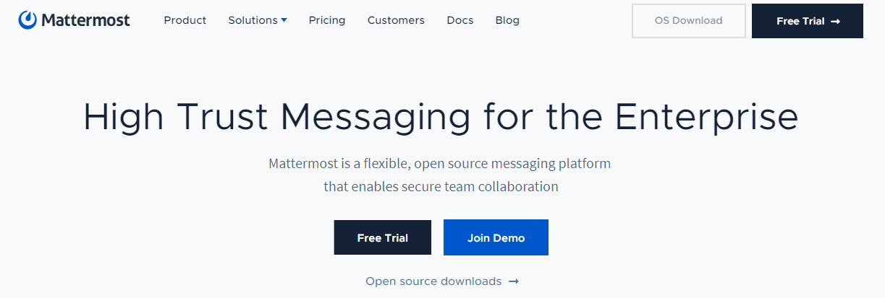
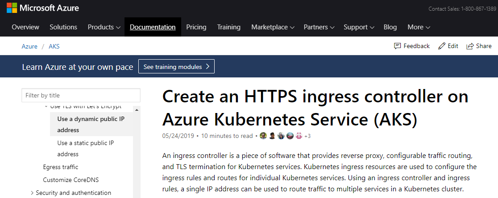
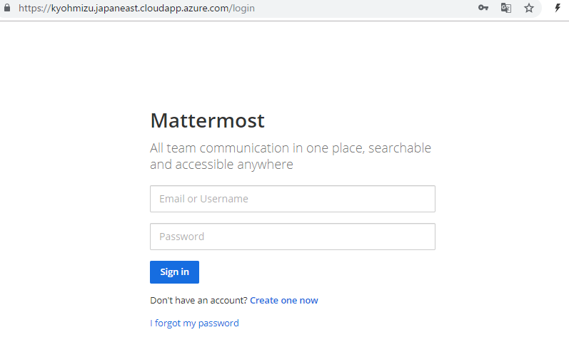

class: center, middle, blue
# もくもく成果発表

---
### whoami

.left-small[
    
]

.right-large[
- Kyohei Mizumoto(@kyohmizu)

- C# Software Engineer

- Interests
    - Docker/Kubernetes
    - Go
    - Security
]

---
class: center, middle, blue
## AKSクラスタに機能追加

---
### 運用アプリ

<u><https://mattermost.com/></u>

<center></center>

---
### 構成

.zoom2[
- Kubernetesクラスタ(AKS)

  - Mattermost

  - Prometheus

  - Grafana

- Azure Load Balancer

- Azure Database for PostgreSQL server

- Azure Key Vault
]

---
### ツール

- Terraform

  - AKSクラスタの構成管理

- Helm

  - Chartのインストール

  - テンプレートエンジン

---
class: center, middle, blue
## 今日の取り組み

---
class: center, middle, blue
## アプリ通信のTLS対応

---
### 参考URL
  
<u><https://docs.microsoft.com/en-us/azure/aks/ingress-tls></u>

<center></center>

---
### 手順

- (helm)Ingress コントローラーを作成

- (az)IPアドレスにFQDNを設定

- (helm)cert-manager をインストール

- (kubectl)ClusterIssuer を作成

- (kubectl)Ingress リソースを作成

---
### 困った点

.zoom2[
```bash
$ helm template --name cert-manager --namespace cert-manager \
  cert-manager-v0.8.1.tgz > cert-manager.yaml
$ kubectl apply -f cert-manager.yaml

Error!!
```
]

- template で作成したマニフェストを使うとエラー

- 仕方ないので普通にインストール

.zoom2[
```bash
$ helm install --name cert-manager --namespace cert-manager \
  --version v0.8.1 jetstack/cert-manager
```
]

---
### 成果

- TLS対応できた

- cert-manager が使えるようになった

- Ingress に多少詳しくなった

- Makefile 難しい…

---

<center></center>

---
### 構成

.zoom2[
- Kubernetesクラスタ(AKS)

  - Mattermost

  - Prometheus

  - Grafana

  - <font color="DeepPink">Cert Manager(New!)</font>

- Azure Load Balancer

- Azure Database for PostgreSQL server

- Azure Key Vault
]

---
### 今後追加したい機能

.zoom2[
- ログ管理

  - fluentd

- Continuous Delivery

  - Spinnaker or Tekton

- サービスメッシュ

  - Istio or SMI

- Azureサービスの構成管理
]

---
### ソース

<u><https://github.com/kyohmizu/mattermost-aks></u>

---
class: center, middle, blue
# Thank you!
